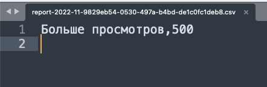

## Wallet-service

Сервис для работы с балансом пользователей. Разработан в
качестве [тестового задания](https://github.com/avito-tech/internship_backend_2022).
Сервис предоставляет JSON HTTP API.

Реализованы методы:

- зачисление средств,
- резервирование средств,
- списание средств,
- разрезервирование средств,
- получение баланса пользователя,
- получение списка транзакций,
- получение отчета выручки по всем услугам за определенный период.

## Стек

1. Язык разработки: Golang.
2. Реляционная СУБД: PostgreSQL.
3. Объектное хранилище: MinIO.
4. Docker и docker-compose для развертывания сервиса.
5. OpenAPI (Swagger) для API.

## Допущения, сделанные при разработке

1. За единицу измерения денег взята копейка.
2. Для оплаты заказа покупки услуги вначале резервируются деньги на счету при помощи метода **/reserve**, а затем
   вызывается метод списания средств **/writeOff**. Без первоначального резервирования, списание средств не
   предусмотрено.
3. Так как метод списания (по заданию) на вход получает те же параметры, что и при резервировании, то есть опасность в
   ошибочных (несоответствующих / несогласованных) данных. Сервис не выполняет операцию и отвечает ошибкой, если хотя бы
   один идентификатор (пользователя, заказа, сервиса) не совпадает. Если отличается только сумма, то здесь 2 варианта:

- если новая сумма больше зарезервированной, то операция не выполняется и в ответ получаем ошибку, так как на балансе
  может не хватить средств;
- если новая сумма меньше зарезервированной, то списываем новую сумму, а разницу возвращаем на баланс (**смотри п.5 в
  сценарии тестирования**).

4. В сервисе предусмотрено 2 метода получения списка транзакций, отличающиеся видами пагинации:

- пагинация по дате и сумме (метод limit-offset) (**смотри п.8 в сценарии тестирования**);
- пагинация по дате с использованием временных интервалов, где явно указываем точки начала и конца интервала (**смотри
  п.9 в сценарии тестирования**). Данный метод был реализован, так как на практике чаще всего нас интересуют транзакции,
  отсортированные по времени от новых к старым.

## Запуск приложения и зависимостей

1. Склонировать репозиторий.

```shell
git clone https://github.com/frutonanny/wallet-service.git
```

2. Перейти в репозиторий.

```shell
cd wallet-service
```

3. Выполнить команду запуска приложения и его зависимостей.

```shell
docker-compose -f deployments/docker-compose.yaml --profile dev up --build --detach
```

## Простейший сценарий тестирования приложения

1. Пополняем кошелек пользователя с userID на некоторую сумму.

```
curl -X POST --location "http://localhost:8081/v1/add" \
    -H "Content-Type: application/json" \
    -d "{
          \"userID\": 1,
          \"cash\": 1000
        }"
```

В ответе ожидаем получить баланс пользователя с учетом пополнения.

```json
{
  "data": {
    "balance": 1000
  }
}
```

2. Проверим прямым запросом, что кошелек пользователя создался, и баланс был пополнен.

```
curl -X POST --location "http://localhost:8081/v1/getBalance" \
    -H "Content-Type: application/json" \
    -d "{
          \"userID\": 1
        }"
```

В ответе ожидаем получить ответ, аналогичный ответу из п. 1.

```json
{
  "data": {
    "balance": 1000
  }
}
```

3. Зарезервируем некую сумму у пользователя с userID для оплаты заказа с orderID услуги serviceID.

```
curl -X POST --location "http://localhost:8081/v1/reserve" \
    -H "Content-Type: application/json" \
    -d "{
          \"userID\": 1,
          \"serviceID\": 1,
          \"orderID\": 1,
          \"price\": 500
        }"
```

В ответе ожидаем получить актуальный баланс пользователя без учета зарезервированной суммы. Т.е. 1000 - 500 = 500.

```json
{
  "data": {
    "balance": 500
  }
}
```

4. Проверим прямым запросом, что сумма была точно зарезервирована и не учитывается в балансе.

```
curl -X POST --location "http://localhost:8081/v1/getBalance" \
    -H "Content-Type: application/json" \
    -d "{
          \"userID\": 1
        }"
```

В ответе ожидаем получить ответ, аналогичный ответу из п. 3.

```json
{
  "data": {
    "balance": 500
  }
}
```

5. Списываем средства у пользователя userID, зарезервированные по заказу orderID.

В качестве суммы списания будем указывать сумму меньшую, чем зарезервировали в п. 3 по заказу orderID. Ожидаем, что
разница между резервом и списанием вернется на баланс пользователя.

```
curl -X POST --location "http://localhost:8081/v1/writeOff" \
    -H "Content-Type: application/json" \
    -d "{
          \"userID\": 1,
          \"serviceID\": 1,
          \"orderID\": 1,
          \"price\": 250
        }"
```

В ответе получим актуальный баланс пользователя. 500 + (500 - 250) = 750.

```json
{
  "data": {
    "balance": 750
  }
}
```

6. Снова зарезервируем некую сумму у пользователя с userID для оплаты другого заказа с orderID другой услуги serviceID.

```
curl -X POST --location "http://localhost:8081/v1/reserve" \
    -H "Content-Type: application/json" \
    -d "{
          \"userID\": 1,
          \"serviceID\": 2,
          \"orderID\": 2,
          \"price\": 500
        }"
```

В ответе ожидаем получить актуальный баланс пользователя без учета зарезервированной суммы.

```json
{
  "data": {
    "balance": 250
  }
}
```

7. Отменим ранее зарезервированные средства у пользователя userID по заказу orderID.

```
curl -X POST --location "http://localhost:8081/v1/cancel" \
    -H "Content-Type: application/json" \
    -d "{
          \"userID\": 1,
          \"orderID\": 2
        }"
```

В ответе получим актуальный баланс пользователя с учетом разрезервированных средств.

```json
{
  "data": {
    "balance": 750
  }
}
```

8. Запрашиваем историю транзакций для пользователя userID.

```
curl -X POST --location "http://localhost:8081/v1/getTransactions" \
    -H "Content-Type: application/json" \
    -d "{
          \"userID\": 1,
          \"limit\": 10,
          \"offset\": 0,
          \"sortBy\": \"amount\",
          \"direction\": \"desc\"
        }"
```

Ожидаем в ответе получить пять транзакций в таком порядке:

- Зачисление (п. 1).
- Резервирование по заказу 1 (п. 3).
- Резервирование средств по заказу 2 (п. 6).
- Отмена зарезервированных средств по заказу 2 (п. 7).
- Списание по заказу 1 (п. 5).

```json
{
  "data": {
    "transactions": [
      {
        "amount": 1000,
        "createdAt": "2022-11-09T07:05:14.714203Z",
        "description": "Зачисление средств"
      },
      {
        "amount": 500,
        "createdAt": "2022-11-09T07:06:16.365399Z",
        "description": "Резервирование средств по заказу 1"
      },
      {
        "amount": 500,
        "createdAt": "2022-11-09T07:13:01.548774Z",
        "description": "Резервирование средств по заказу 2"
      },
      {
        "amount": 500,
        "createdAt": "2022-11-09T07:19:05.162304Z",
        "description": "Отмена резервирования средств по заказу 2"
      },
      {
        "amount": 250,
        "createdAt": "2022-11-09T07:06:46.389376Z",
        "description": "Списание средств по заказу 1"
      }
    ]
  }
}
```

9. Так как на практике чаще всего нас интересуют транзакции, отсортированные по времени (от новых к старым), то был
   реализован метод получения транзакций по временному промежутку.
   Запрашиваем историю транзакций для пользователя userID. 
 Не знаю, когда будут проверять, поэтому осмысленно задан широкий временной диапазон.

```
curl -X POST --location "http://localhost:8081/v1/getTransactionsByTime" \
    -H "Content-Type: application/json" \
    -d "{
          \"userID\": 1,
          \"start\": \"2022-11-01T07:06:00Z\",
          \"end\": \"2022-12-01T07:20:00Z\"
        }"
```

Ожидаем в ответе получим пять транзакций:

- Отмена зарезервированных средств по заказу 2 (п. 7).
- Резервирование средств по заказу 2 (п. 6).
- Списание по заказу 1 (п. 5).
- Резервирование по заказу 1 (п. 3).
- Зачисление (п. 1).

```json
{
  "data": {
    "transactions": [
      {
        "amount": 500,
        "createdAt": "2022-11-09T07:19:05.162304Z",
        "description": "Отмена резервирования средств по заказу 2"
      },
      {
        "amount": 500,
        "createdAt": "2022-11-09T07:13:01.548774Z",
        "description": "Резервирование средств по заказу 2"
      },
      {
        "amount": 250,
        "createdAt": "2022-11-09T07:06:46.389376Z",
        "description": "Списание средств по заказу 1"
      },
      {
        "amount": 500,
        "createdAt": "2022-11-09T07:06:16.365399Z",
        "description": "Резервирование средств по заказу 1"
      },
      {
        "amount": 1000,
        "createdAt": "2022-11-09T07:05:14.714203Z",
        "description": "Зачисление средств"
      }
    ]
  }
}
```

10. Запрашиваем отчет за period.

```
curl -X POST --location "http://localhost:8081/v1/getReport" \
    -H "Content-Type: application/json" \
    -d "{
          \"period\": \"2022-11\"
        }"
```

В ответ ожидаем получить ссылку на отчет

```json
{
  "data": {
    "url": "localhost:9000/reports/report-2022-11-9829eb54-0530-497a-b4bd-de1c0fc1deb8.csv"
  }
}
```

По ссылке можно скачать файл report-2022-11-9829eb54-0530-497a-b4bd-de1c0fc1deb8.csv.
Ожидаем получить следующее содержание:

